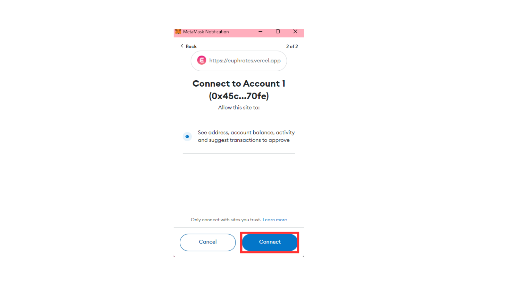

# Setup Wallet

### Unified Account

With the Unified Account system, users can use an Ethereum account to interact with contracts in EVM, Polkadot/Acala Substrate runtime, and a hybrid of these. Euphrates will support Ethereum LST and pools and beyond, so with Unified Account, you set it up once, and can use it for cross-stack cross-chain interactions. Read more [here](./#unified-account).

### Pre-requisites

1. Ethereum wallet e.g. MetaMask with an account not bound to any Polkadot/Substrate account. ([Create a MetaMask Wallet](https://support.metamask.io/hc/en-us/articles/360015489531-Getting-started-with-MetaMask), [create an additional account in the Wallet](https://support.metamask.io/hc/en-us/articles/360015289452-How-to-create-an-additional-account-in-your-wallet))
2. Substrate Wallets e.g. Polkadot{js}, Talisman, Subwallet with an account not bound to any Ethereum account. ([Create a Substrate Wallet](https://wiki.acala.network/get-started/acala-network/acala-account/account-generation))
3. ACA in your Substrate Wallet to pay for transaction fees ([Fund Your Substrate Wallet](https://wiki.acala.network/integrate/integration/token-transfer))

### Set up a Unified Account

To enable Unified Account and use Acala EVM+, you will

1. Login with a supported Ethereum wallet e.g. MetaMask, Wallet Connect
2. Login (once) with a Polkadot/Substrate wallet e.g. Polkadot{js}, Talisman, Subwallet
3. Sign a transaction to bind the two accounts

### Step-by-Step Guide

To setup

1. Go on the Euphrates App and click “Connect Wallet”

<figure><figcaption></figcaption></figure>

2. Click MetaMask or your Ethereum wallet of choice via Wallet Connect

<figure><figcaption></figcaption></figure>

3. Select the account you wish to connect and click “Next”

<figure><figcaption></figcaption></figure>

4. Confirm the selection by clicking “Connect”

<figure><figcaption></figcaption></figure>

5. If this is your first time interacting with the Acala Network you will be asked to add the network to your Metamask and switch to it. Click “Approve” then “Switch Network”.&#x20;

<figure><figcaption></figcaption></figure>

If you are having trouble connecting your MetMask, you can either add it via [Acala on ChainList](https://chainlist.org/chain/787), or manually add the Acala network by opening your MetaMask wallet and going to Settings-> Networks -> Add Networks and entering the following information:\
\
**Network Name:** Acala

**New RPC URL**`https://eth-rpc-acala.aca-api.network/`

**Chain ID:** 787

**Currency Symbol:** ACA

**Block Explorer URL**`https://blockscout.acala.network/`&#x20;

6. Select your Substrate Wallet

<figure><figcaption></figcaption></figure>

7. Select the account you wish to connect and click “Connect”

<figure><figcaption></figcaption></figure>

8. Ensure you have the correct accounts and click “Bind”. **Binding is permanent and cannot be undone once completed.**

<figure><figcaption></figcaption></figure>

9. Sign the transaction on your Ethereum Wallet, then Approve the binding on your Substrate Wallet

<figure><figcaption></figcaption></figure>

10. Congratulations, you have successfully unified your wallets 🎉

<figure><figcaption></figcaption></figure>
