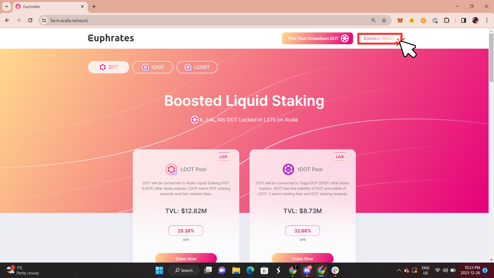

# Check Unified Account Status

### Using Euphrates

1. Go to [farm.acala.network](http://farm.acala.network/) and click connect wallet

<figure><figcaption></figcaption></figure>

2. In the ‘Unified Account” section click the hyperlink ‘here’

<figure><figcaption></figcaption></figure>

3. Paste in either your Ethereum address or Substrate address then click “Check”

<figure><figcaption></figcaption></figure>

4. If your account is bound, it will display the binded address in the empty field. If your account isn’t bound, it will display “no bound account” in the empty field.

<figure><figcaption></figcaption></figure>

### Using Polkadot.js

At the Polkadot.js UI you can easily query Unified Account with a Substrate or Ethereum account, just step by step below, follow this link to skip steps 1-3 and start from step 4.

1. Browse https://polkadot.js.org,
2. Select Acala network,&#x20;
3. Go to Developer tab on top menu and select Chain State
4. Select "EVM accounts" and "accounts(H160): Option\<AccountId32>"

When you try to bind a Substrate account to an Ethereum account and it states that it's already bound, then you can&#x20;

* use the above method to find out which Ethereum account it is
* log in with that Ethereum account instead OR
* use a different Substrate account to bind

<figure><figcaption></figcaption></figure>

