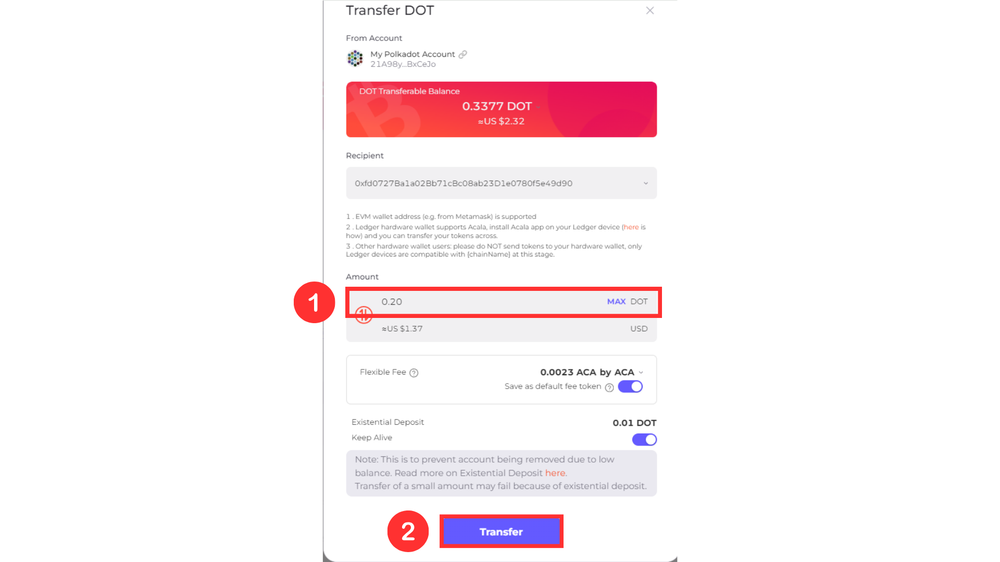

# Via Acala Network Visual Guide

1. Go to the portfolio tab on the Acala DApp platform : [https://apps.acala.network/portfolio](https://apps.acala.network/portfolio) and connect your wallet

<figure><figcaption></figcaption></figure>

2. Scroll down to the ASSET section and find your DOT holdings

<figure><figcaption></figcaption></figure>

3. Click on the “Transfer” button

<figure><figcaption></figcaption></figure>

4. Copy your Ethereum wallet address and paste it into the Recipient box.

<figure><figcaption></figcaption></figure>

Your wallet address can be found within your wallet or on [Euphrates](https://farm.acala.network/) by clicking on your wallet address on the top right corner followed by the copy icon.

<figure><figcaption></figcaption></figure>

5. Enter the amount of DOT you would like to transfer and click Transfer

<figure><figcaption></figcaption></figure>

6. Sign the transaction and wait for confirmation. Your DOT will update on Euphrates.
