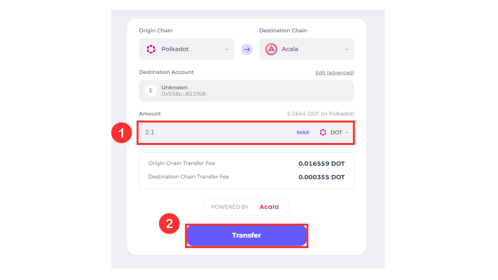

# Via Centralized Exchange Visual Guide

1. From any Exchange, e.g. Binance, withdraw DOT to your Substrate wallet (Polkadot Network).

<figure><figcaption></figcaption></figure>

2. Visit Acala platform’s Bridge tab : [https://apps.acala.network/bridge](https://apps.acala.network/bridge)and connect your Substrate wallet

<figure><figcaption></figcaption></figure>

3. Ensure that the Origin Chain is “Polkadot” and the Destination Chain is “Acala”

<figure><figcaption></figcaption></figure>

4. For the Destination Account, click the “Edit (advanced)” button on the top right of the input field

<figure><figcaption></figcaption></figure>

5. Clear the box and paste your Ethereum wallet address and click Confirm

<figure><figcaption></figcaption></figure>

Your wallet address can be found within your wallet or on [Euphrates](https://farm.acala.network/) by clicking on your wallet address on the top right corner after successfully connecting.

<figure><figcaption></figcaption></figure>

6. Enter the amount of DOT you wish to transfer and click Transfer

<figure><figcaption></figcaption></figure>

7. Sign the transaction and wait for confirmation. Your DOT will update on Euphrates.
