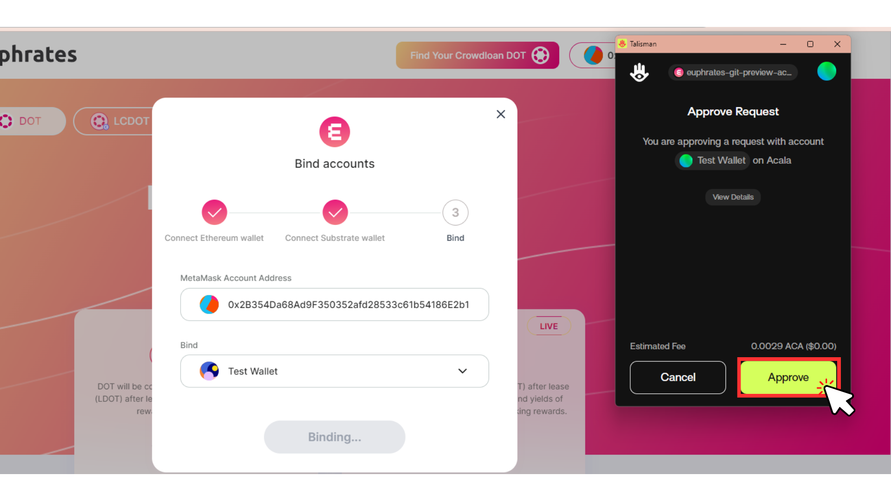
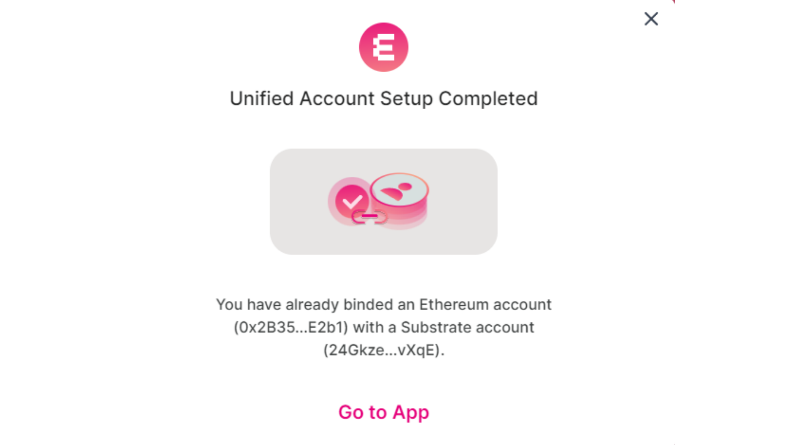

# Unified Account Visual Guide

_You will need a small amount of ACA to pay for the transaction fee of binding (\~0.003 ACA)_

1. Go to [https://farm.acala.network/](https://farm.acala.network/) and click “Connect Wallet”.

<figure><figcaption></figcaption></figure>

2. Select Either Metamask, Binance Wallet or WalletConnect to connect your wallet.

<figure><figcaption></figcaption></figure>

3. Select your Substrate wallet that you will bind and click connect.

<figure><figcaption></figcaption></figure>

4. Ensure the wallet addresses are correct and click bind. **Binding is non-reversible.**

<figure><figcaption></figcaption></figure>

5. Approve the transaction on your Ethereum wallet and Substrate wallet.

<figure><figcaption></figcaption></figure>

6. Congratulations, you’ve created a Unified Account, a completion message will pop up. You may now log in with your Ethereum wallet to sign Substrate transactions.

<figure><figcaption></figcaption></figure>
