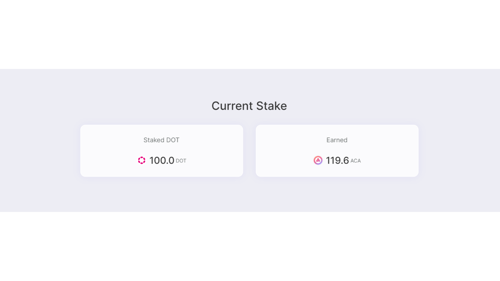

# Stake DOT

Coming soon

1. Select “DOT” near the top of the homepage or make sure you are on the official Euphrates DOT staking page: https://farm.acala.network/dot

<figure><figcaption></figcaption></figure>

2. Connect your wallet to the application
3. Choose an LST pool you are interested in and click “Stake Now”

<figure><figcaption></figcaption></figure>

4. Read the details of the pool and scroll down to the “Stake your DOT” section
5. Enter the amount of DOT you would like to stake and click “Stake Now”

<figure><figcaption></figcaption></figure>

6. A confirmation transaction will show up on your Metamask (If this is your first time interacting with Euphrates, an approval request will show up first). Confirm the transaction.

<figure><figcaption></figcaption></figure>

7.  You can verify your stake on the “Current Stake’ Section. Happy staking 😊

    <figure><figcaption></figcaption></figure>

