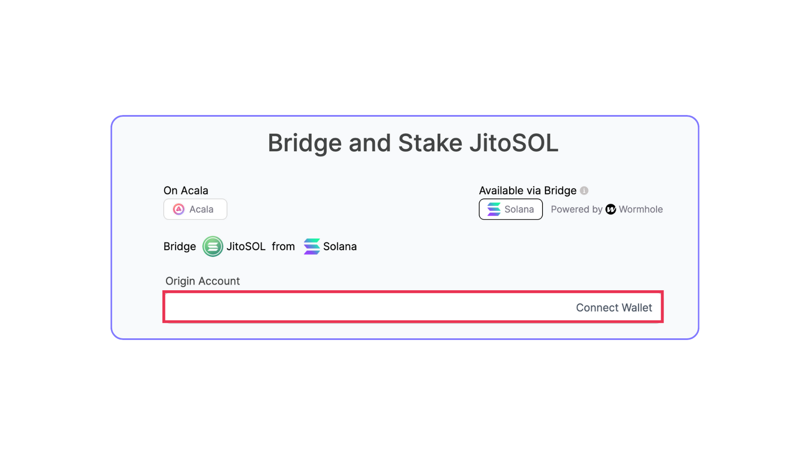

# Stake JitoSOL

### **Prerequisite:**

Ensure you have Solana (SOL) in your Phantom or Solana wallet. If you don’t hold any SOL, you can purchase or trade for tokens on several centralized or decentralized exchanges.

If you currently hold JitoSOL, you may skip to Step 4.

### **Step-by-Step Guide**

1.  Go to [https://www.jito.network/staking/](https://www.jito.network/staking/) and connect your Solana wallet.

    <figure><figcaption></figcaption></figure>
2.  Enter the amount of SOL you wish to stake and click “Convert to JitoSOL”.

    <figure><figcaption></figcaption></figure>
3. Go to [https://farm.acala.network/](https://farm.acala.network/ldot)pool/6.

<figure><figcaption></figcaption></figure>

4. Connect your Metamask or EVM wallet to Euphrates platform.

<figure><figcaption></figcaption></figure>

5.  Navigate to Solana section, connect your Phantom or Solana Wallet in the “Origin Account” section.

    <figure><figcaption></figcaption></figure>
6.  Enter the amount of JitoSOL you would like to stake, click “Stake Now” and confirm the transaction in your wallet.

    <figure><figcaption></figcaption></figure>
7.  Wait for the Bridge + Stake process to complete. You may move off of the screen once the “submit transaction” portion is complete.

    <figure><figcaption></figcaption></figure>
8.  Once complete, you may scroll down to the bottom of the page to monitor current stake and see your accrued rewards

    <figure><figcaption></figcaption></figure>
