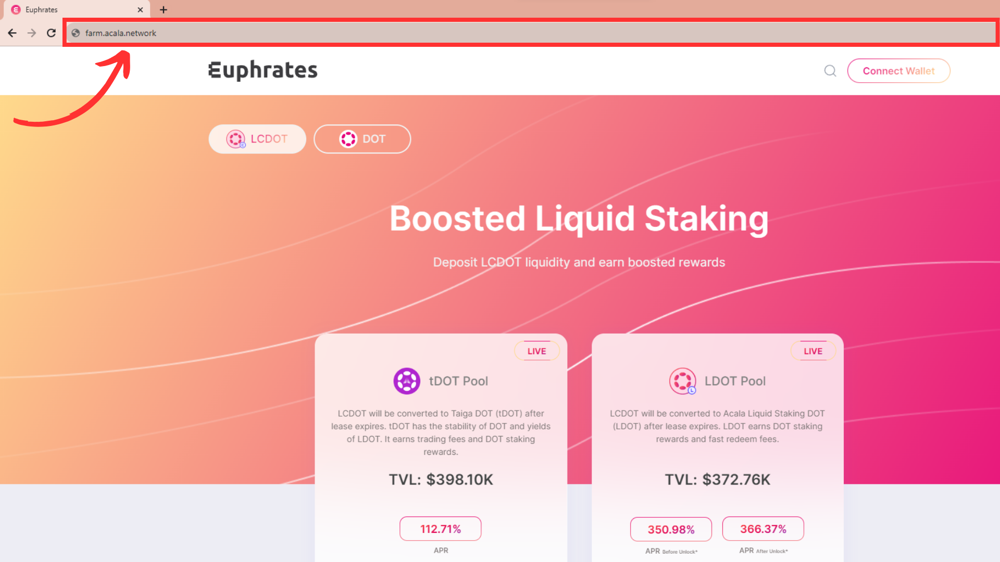
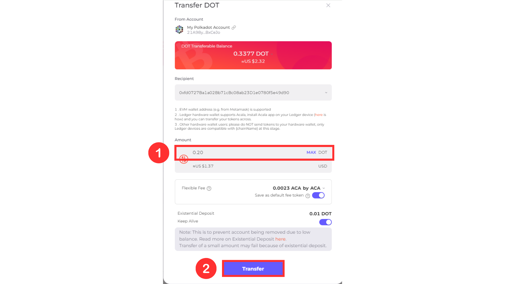

# Stake LCDOT

### **Prerequisite:**

Make sure you have set up a Unified Account, follow the guide [here](../setup-wallet.md).

### **Step-by-Step Guide**

1. Make sure you are on the Euphrates official site with LCDOT selected

<figure><figcaption></figcaption></figure>

2. Connect your wallet to the application
3. Choose an LST pool you are interested in and click “Stake Now”

<figure><figcaption></figcaption></figure>

4. Read the details of the pool and scroll down to the “Stake your LCDOT” section
5. Enter the amount of LCDOT you would like to stake and click “Stake Now”

<figure><figcaption></figcaption></figure>

6.  A confirmation transaction will show up on your Metamask (If this is your first time interacting with Euphrates an approval request will show up first). Confirm the transaction.

    <figure><figcaption></figcaption></figure>
7.  You can verify your stake on the “Current Stake’ section. Happy staking 😊

    <figure><figcaption></figcaption></figure>

