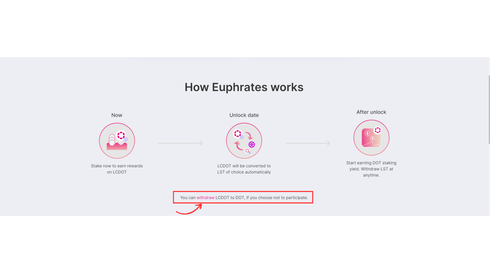

# Withdraw DOT from LCDOT

Follow this guide to withdraw DOT from LCDOT.&#x20;

Pre-requisite

* Follow [this guide](../setup-wallet/) to set up a Unified Account
* Ensure that you have transferrable LCDOT on your account e.g. NOT in LP or staked

1. Make sure you are on the Euphrates official site: [https://farm.acala.network/](https://farm.acala.network/)
2.  Scroll down to the ‘How Euphrates Works’ section and click the highlighted ‘withdraw’ button

    <figure><figcaption></figcaption></figure>

3. Enter the amount of LCDOT you would like to withdraw and click “Withdraw”

<figure><figcaption></figcaption></figure>

4. A confirmation transaction will show up on your Metamask (If this is your first time interacting with Euphrates, an approval request will show up first). Confirm the transaction.

<figure><figcaption></figcaption></figure>

5. Your DOT is ready 😊
